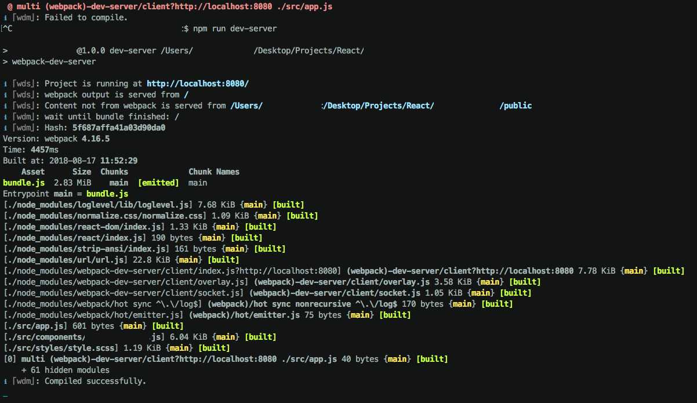
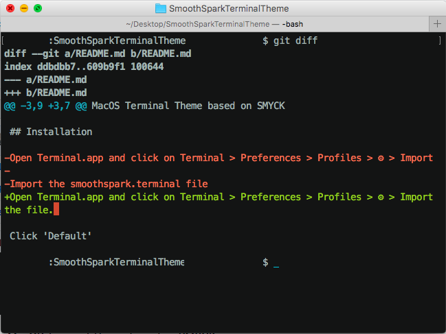
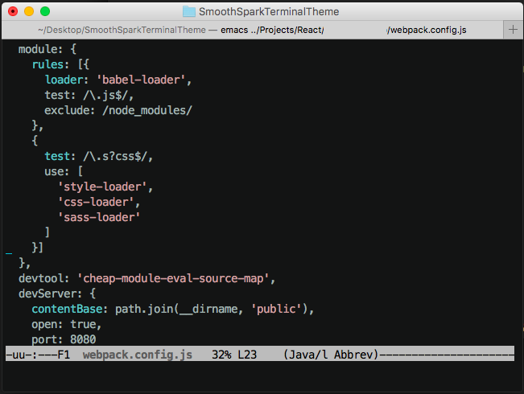

## SmoothSparkTerminalTheme
MacOS Terminal Theme based on SMYCK

## Installation

Open Terminal.app and click on Terminal > Preferences > Profiles > ⚙ > Import.

Select smoothspark.terminal file. 

Click 'Default'

## Screenshots

